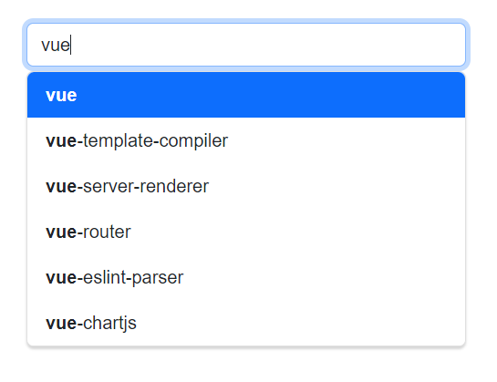

# Auto-complete-vueJs
Simple autocomplete component using Bootstrap and VueJs
- Support v-model
- Support api

# Available props

|    Prop    |   Type   | Required | Default |                                               Description                                               |
|:----------:|:--------:|:--------:|:-------:|:-------------------------------------------------------------------------------------------------------:|
|   search   | Function |   Yes    |         |    The function to be executed on user input to get a list of proposition. Its asynchronous function    |
|  debounce  |  Number  |    No    |   200   | Time in milliseconds that the component should wait after last keystroke before calling search function |
| serializer | Function |    No    |         |     For complex search results, this function is executed to get the value to display in the input      |
|  v-model   |          |    No    |         |                                                                                                         |
|    type    |  String  |    No    |  text   |                                              Type of input                                              |
| maxlength  |  String  |    No    |   300   |                                                                                                         |
|  disabled  | Boolean  |    No    |  false  |                                                                                                         |

# Available events

|    Prop    |                                                   Description                                                    |
|:----------:|:----------------------------------------------------------------------------------------------------------------:|
|   submit   | Triggered when an autocomplete item is selected. The entry in the input data array that was selected is returned |

# Auto-complete-vueJs in action
